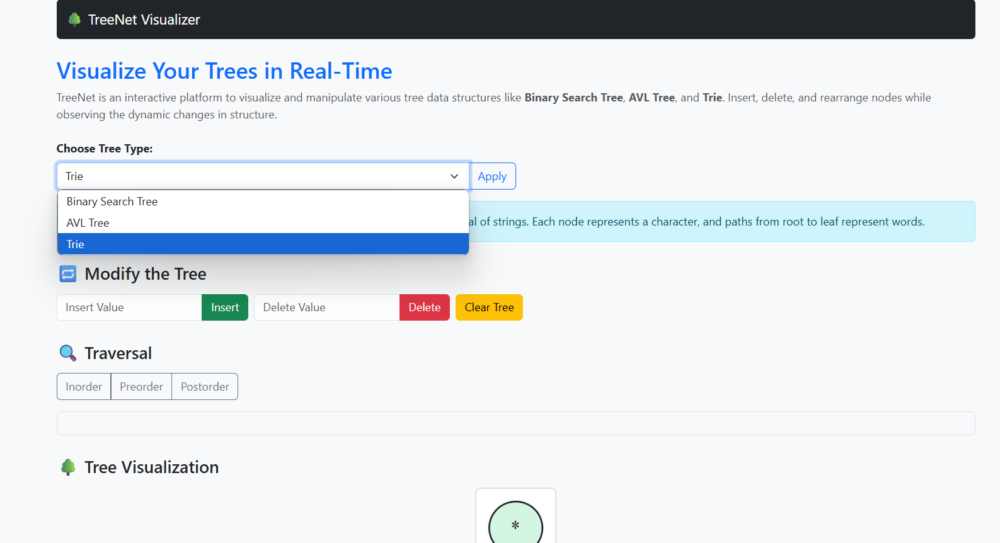

# 🌳 TreeNet – Interactive Tree Visualizer

TreeNet is an interactive web application that allows users to **visualize, modify, and explore tree data structures** like **Binary Search Tree**, **AVL Tree**, and **Trie** in real time using Python and Flask. Designed for educational and demonstrative purposes, TreeNet offers dynamic insertion, deletion, rearrangement, and graphical traversal of nodes.



---

## 🚀 Features

- 🔁 **Insert/Delete** nodes into Binary, AVL, or Trie structures
- 🌐 **Live Graph Rendering** using Graphviz (via PyDot)
- 🌳 **Rearrange Binary Tree** into a balanced tree
- 🧠 **Preorder, Inorder, Postorder** traversals (for BST/AVL)
- 📘 **Trie** string prefix insertion and search
- 📷 **Dynamic Image Generation** after every operation
- 🎨 Colored node and edge visualization
- 🧩 **Session-aware UI** — retains selected tree after reload

---

## 🛠️ Tech Stack

| Tech           | Description                                |
|----------------|--------------------------------------------|
| Python         | Backend logic and tree data structures     |
| Flask          | Web framework for UI and API endpoints     |
| PyDot + Graphviz| Tree graph visualization                  |
| Bootstrap      | Responsive and clean frontend UI           |
| HTML + JS      | Dynamic behavior and fetch traversal data  |

---

## 📂 Directory Structure

```
Treenet-visualizer/
│
├── app.py # Main Flask backend
├── templates/
│ └── index.html # Frontend HTML with UI
├── static/
│ └── tree.png # Auto-generated tree graph
├── trees/
│ ├── binary_tree.py # Binary Search Tree logic
│ ├── avl_tree.py # AVL Tree logic
│ └── trie.py # Trie data structure
├── utils/
│ ├── graph_drawer.py # Tree drawing logic using pydot
│ └── helpers.py # Rearrangement (balance) logic
└── README.md # This file
```

---

## ⚙️ Setup Instructions

1. **Clone the Repository**

```bash
git clone https://github.com/nagakoushik24/Treenet.git

pip install -r requirements.txt

python app.py
```

## 🧪 Sample Usage

- Choose a tree type (Binary / AVL / Trie)
- Insert numeric values (or lowercase strings for Trie)
- Rearrange Binary tree to make it balanced
- Delete nodes
- Visualize structure and traverse using buttons

## 📘 Educational Use Cases

#### This project is ideal for:

- **DSA Learning:** Visual understanding of insertions and rotations

- **Classroom Demos:** Live manipulation of trees during teaching

- **Algorithm Debugging:** Analyze AVL balancing steps and structure
